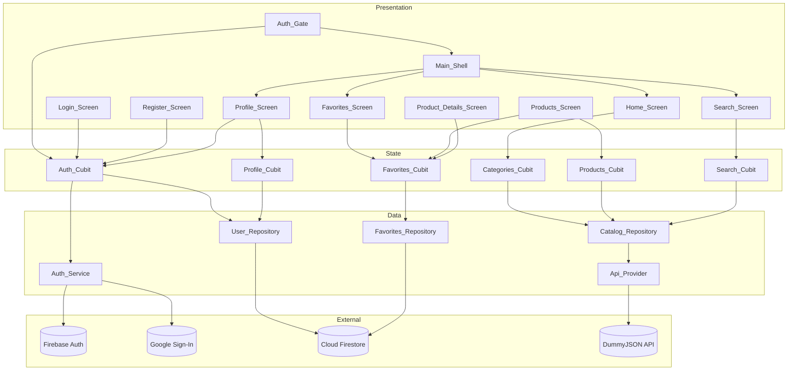
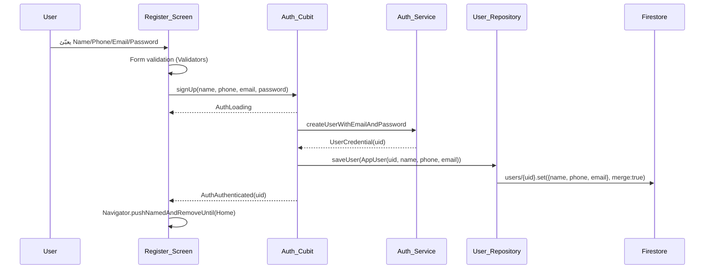
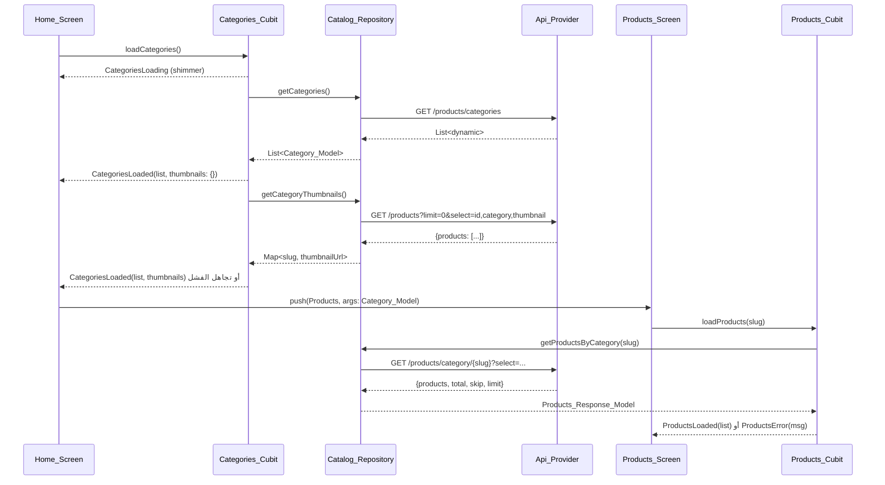
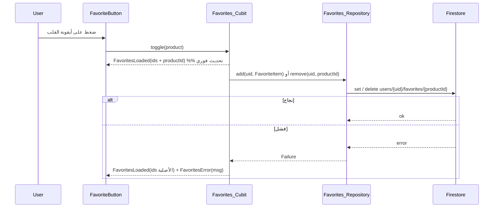
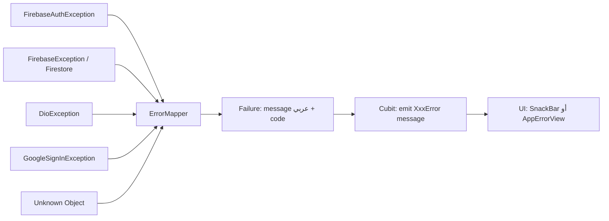

# Design Document

## Overview

`ecommerce-catalog-app` هو تطبيق Flutter (اسم الحزمة `shopify`) بمعمارية ثلاث طبقات: **Presentation (Screens + Widgets)** → **State (Cubits)** → **Data (Services / Repositories / Api_Provider + Models)**. التطبيق يعتمد على Firebase Authentication و Cloud Firestore للمصادقة وبيانات المستخدم والمفضّلة، وعلى DummyJSON REST API لبيانات الكتالوج والبحث، وعلى `flutter_bloc` لإدارة الحالة. الهوية البصرية مطابقة لنظام **Lux-Commerce (ESTUDIO)** المنسوخ إلى `design/stitch/`.

### نتائج البحث والتحقق (تؤثر مباشرة على التصميم)

1. **حالة المشروع الحالية** (تم قراءتها من الملفات):
   - `lib/main.dart` = تطبيق العدّاد الافتراضي → سيُستبدل بالكامل.
   - `lib/firebase_options.dart` مولَّد ويحتوي `android` و `ios` فقط (projectId `shopify-44702`، `iosBundleId: com.example.shopify`، `iosClientId` موجود). ملاحظة: الأخطاء الظاهرة حاليًا في هذا الملف سببها عدم تثبيت `firebase_core` وستختفي بعد `flutter pub get`.
   - `pubspec.yaml` بدون أي حزم إضافية → كل الحزم تُضاف في المهمة الأولى.
   - `android/app/build.gradle.kts` يستخدم `minSdk = flutter.minSdkVersion` → يجب تثبيته على 23 صراحةً لأن `firebase_auth` يتطلب minSdk 23.
   - `android/app/google-services.json` موجود، و `ios/Runner/GoogleService-Info.plist` **غير موجود** → خطوة إعداد يدوية إلزامية لـ iOS.

2. **ملفات التصميم** (تم قراءتها من `C:\Users\Ahmed\Desktop\stitch_premium_flutter_catalog_app` ونسخها إلى `design/stitch/` داخل المشروع):
   - `lux_commerce_system/DESIGN.md`: كل الـ Design Tokens (ألوان، تدريج Inter، radii، spacing، ظلال) وقواعد المكوّنات (أزرار، كروت، حقول، شيبس، شريط سفلي).
   - `auth_login_register/code.html`: شاشة واحدة تتبدّل بين Login و Register، حقول بحدود `outline-variant` وحواف 12px، زر أساسي أسود بحواف 16px، هيدر ثابت بعنوان `ESTUDIO`.
   - `home_categories_grid/code.html`: greeting بـ display-lg، حقل بحث بخلفية `surface-container-low`، جريد أقسام **غير متماثل** (بلاطات مربعة وأخرى تمتد صفّين) بصور خلفية + تدرّج أسود + اسم القسم، وشريط سفلي بأربع أيقونات.
   - `category_smartphones_listing/code.html`: عنوان القسم headline-lg، شيبس، كروت منتجات بنسبة 4:5 وخلفية `#F5F5F7` وصورة `contain`، تحت الصورة العنوان + السعر + شارة تقييم، وأيقونة favorite أعلى الكارت.
   - `product_details_iphone_14_pro/code.html`: كاروسيل بنسبة 4:5 مع نقاط مؤشر، شريط علوي بزر رجوع + favorite، عنوان + سعر + نجوم، **bento grid** بخليتين، وصف بـ body-lg، أقسام قابلة للفتح، وزر ثابت أسفل الشاشة.
   - `user_profile_settings/code.html`: أفاتار دائري 128px بحدود بيضاء، الاسم/البريد/الهاتف، قائمة عناصر داخل كارت أبيض بفواصل، وزر Logout أسود بعرض كامل.
   - مجلدات الأيقونات (`home_icon`, `search_icon`, `favorite_icon`, `profile_icon`, `menu_icon`, `shopping_bag_icon`, `back_arrow_icon`) كلها **Material Symbols Outlined** → تُنفَّذ بحزمة `material_symbols_icons` بدل ملفات أصول.
   - صور الديزاين كلها روابط توضيحية من Google؛ صور التطبيق الحقيقية تأتي من DummyJSON (`thumbnail` و `images`).
   - انحرافات مقصودة عن الديزاين: زر **Google Sign-In** غير موجود في تصميم الـ auth → يُضاف كزر ثانوي (خلفية شفافة + حدّ أسود 1.5px) حسب قواعد النظام؛ وعناصر Cart / Orders / Addresses / Payment / فلترة وSort خارج النطاق المتفق عليه → تُحذف، وتاب المفضّلة يحلّ محلّ زر السلة كإجراء أساسي في شاشة التفاصيل.

3. **`google_sign_in` 7.x**: واجهة الحزمة تغيّرت جذريًا مقارنة بـ 6.x ([MIGRATION.md](https://github.com/flutter/packages/blob/main/packages/google_sign_in/google_sign_in/MIGRATION.md)). الخلاصة المؤثرة على التصميم (تمت إعادة الصياغة للامتثال لقيود الترخيص):
   - `GoogleSignIn` أصبح singleton يُستخدم عبر `GoogleSignIn.instance`.
   - يوجد استدعاء `initialize()` إلزامي مرة واحدة قبل أي عملية أخرى.
   - `signIn()` استُبدل بـ `authenticate()`، و `signInSilently()` بـ `attemptLightweightAuthentication()`.
   - المصادقة (authentication) والتصريح بالنطاقات (authorization) خطوتان منفصلتان؛ لا نحتاج نطاقات إضافية هنا، لذا نستخدم `authenticate()` فقط ونأخذ `idToken`.
   - الإلغاء من المستخدم يُرمى كـ `GoogleSignInException` بالكود `GoogleSignInExceptionCode.canceled` → يُعالج كحالة "لا خطأ" (Requirement 3.5).
   - على Android يُمرَّر `serverClientId` (Web client ID من Firebase) في `initialize` للحصول على `idToken`؛ وعلى iOS يُمرَّر `clientId` من `DefaultFirebaseOptions.ios.iosClientId`.
   - تكوين credential لـ Firebase: `GoogleAuthProvider.credential(idToken: ...)` ثم `FirebaseAuth.instance.signInWithCredential(...)` ([Firebase federated auth docs](https://firebase.google.com/docs/auth/flutter/federated-auth)).

4. **DummyJSON**:
   - `GET /products/categories` يعيد **مصفوفة** من كائنات `{"slug","name","url"}` (وليس كائنًا ملفوفًا) → الـ decoding يجب أن يتعامل مع `List` مباشرة.
   - `GET /products/category/{slug}` يعيد كائنًا ملفوفًا `{products, total, skip, limit}`، ويقبل `?select=` لتقليص الحقول. القائمة المستخدمة: `id,title,description,category,price,rating,thumbnail,images,brand,stock` (الـ bento grid في شاشة التفاصيل يحتاج `brand` و `stock`).
   - `GET /products/search?q=` يعيد نفس الشكل الملفوف → يُعاد استخدام `ProductsResponseModel`.
   - `GET /products?limit=0&select=id,category,thumbnail` يعيد كل المنتجات في طلب واحد → يُستخدم لاستخراج صورة تمثيلية لكل `slug` لأن استجابة الأقسام لا تحتوي صورًا (بديل عن 24 طلبًا منفصلًا).
   - حقل `category` داخل المنتج يساوي `slug` القسم → المطابقة مباشرة.
   - الحقول الرقمية قد تعود `int` أو `double` (مثل `price` و `rating`) → التحويل يجب أن يمر بـ `num` ثم `toDouble()`.

5. **إصدارات الحزم المتحقَّق منها فعليًا** (بيئة الجهاز: Flutter 3.44.5 / Dart 3.12.2، تم التحقق عبر `flutter pub add --dry-run` فنجح حلّ الاعتماديات بالكامل):

   | الحزمة | الإصدار المثبَّت | الغرض |
   |---|---|---|
   | `firebase_core` | `4.12.1` | تهيئة Firebase |
   | `firebase_auth` | `6.5.6` | المصادقة |
   | `cloud_firestore` | `6.7.1` | وثائق المستخدم والمفضّلة |
   | `google_sign_in` | `7.2.0` | الدخول بحساب Google (واجهة 7.x) |
   | `flutter_bloc` | `9.1.1` | إدارة الحالة (Cubit) |
   | `equatable` | `2.1.0` | مقارنة الموديلات والحالات |
   | `dio` | `5.11.0` | نداءات DummyJSON |
   | `cached_network_image` | `3.4.1` | تخزين الصور مؤقتًا |
   | `shimmer` | `3.0.0` | حالات التحميل |
   | `google_fonts` | `8.2.0` | خط Inter |
   | `material_symbols_icons` | `4.2960.0` | أيقونات Material Symbols Outlined |

   وحزم التطوير: `bloc_test 10.0.0`، `mocktail 1.0.5`، `fake_cloud_firestore 4.2.0`، `glados 1.1.7` (مكتبة الـ PBT الجاهزة لـ Dart).

   > `google_sign_in 7.2.0` يؤكد أن واجهة 7.x هي المستخدمة، لذا يجب اتباع `GoogleSignIn.instance` + `initialize()` + `authenticate()` وليس واجهة 6.x القديمة.

### قرارات تصميمية ومبرراتها

| القرار | المبرر |
|---|---|
| ثيم مبني على `ColorScheme` مُصرَّح صريحًا بقيم Lux-Commerce بدل `fromSeed` | الديزاين يحدّد قيم ألوان دقيقة؛ `fromSeed` سيغيّرها (Requirement 10.1) |
| `google_fonts` لخط Inter و `material_symbols_icons` للأيقونات | الديزاين يعتمد Inter و Material Symbols Outlined، ولا توجد ملفات خطوط/أيقونات في المشروع (Requirement 10.2, 10.6) |
| صورة تمثيلية للأقسام من طلب واحد `/products?limit=0&select=id,category,thumbnail` | استجابة الأقسام بلا صور، والبلاطات في الديزاين تعتمد صورة خلفية؛ طلب واحد أرخص من 24 طلبًا (Requirement 6.10) |
| فشل طلب الصور التمثيلية لا يُعتبر خطأ | الأقسام هي المحتوى الأساسي؛ الصورة تحسين بصري فقط (Requirement 6.14) |
| المفضّلة في `users/{uid}/favorites` بمعرّف وثيقة = `productId` | يمنع التكرار بطبيعته ويجعل التبديل عملية set/delete واحدة، ويُزامن بين الأجهزة (Requirement 14.1, 14.8) |
| `IndexedStack` داخل `Main_Shell` | يحفظ حالة كل تاب وموضع التمرير بدون إعادة تحميل (Requirement 12.3) |
| `Cubit` بدل `Bloc` الكامل | المتطلب يفرض `flutter_bloc`، و Cubit أبسط وأقل boilerplate لعمليات CRUD/Fetch (Requirement 9.1) |
| Repository/Service بين Cubit و SDK | يسمح باختبار الـ Cubits بـ mocks بدون شبكة أو Firebase (Requirement 9.2) |
| `Freezed`/codegen غير مستخدم | تقليل الاعتماديات وزمن البناء؛ حالات الـ Cubit تُكتب يدويًا مع `Equatable` |
| موديلات يدوية (`fromJson`/`toJson`) بدون `json_serializable` | تفادي build_runner، وتسهيل خصائص الـ round-trip المكتوبة يدويًا |
| `dio` بدل `http` | interceptors للـ logging، و timeouts مركزية، وتحويل أخطاء موحّد |
| `Auth_Gate` مبني على `StreamBuilder`/`BlocBuilder` فوق `authStateChanges` | مصدر حقيقة واحد لحالة الجلسة (Requirement 4.2–4.5) |
| تمرير `Product_Model` كامل إلى شاشة التفاصيل | لا حاجة لنداء شبكة إضافي؛ الحقول المطلوبة كلها موجودة في استجابة القسم (Requirement 7.12, 8.1) |
| بحث المنتجات عبر الـ API وبحث الأقسام محليًا | الأقسام قائمة صغيرة محمّلة مسبقًا، أما المنتجات فتحتاج `/products/search` (Requirement 13.3, 13.4) |
| تحديث متفائل (optimistic) لحالة المفضّلة مع تراجع عند الفشل | استجابة فورية للمس مع الحفاظ على الاتساق (Requirement 14.3, 14.7) |
| `Logout` يُحدّث الواجهة فورًا | تجربة استخدام متسقة حتى لو تأخر/فشل الـ signOut (Requirement 4.6, 4.8) |

## Architecture

### هيكل المجلدات

```
lib/
├── main.dart                        # bootstrap: Firebase + GoogleSignIn.initialize + runApp
├── firebase_options.dart            # (موجود، مولَّد)
├── app.dart                         # ShopifyApp: MaterialApp + MultiBlocProvider + routes
├── core/
│   ├── theme/app_colors.dart        # قيم Lux-Commerce الخام
│   ├── theme/app_typography.dart    # تدريج Inter عبر google_fonts
│   ├── theme/app_dimens.dart        # spacing 8/16/24/32/48 + radii 12/16/24 + ظل الكارت
│   ├── theme/app_theme.dart         # ThemeData light + dark
│   ├── constants/api_constants.dart # baseUrl + endpoints + select fields
│   ├── routing/app_routes.dart      # أسماء المسارات + onGenerateRoute
│   ├── errors/failure.dart
│   ├── errors/error_mapper.dart
│   ├── utils/validators.dart        # name/phone/email/password
│   ├── utils/formatters.dart        # price / rating
│   ├── utils/debouncer.dart         # 400ms للبحث
│   └── widgets/                     # AppTextField, PrimaryButton, SecondaryButton,
│                                    # BrandAppBar, AppErrorView, AppEmptyView,
│                                    # ShimmerBox, AppNetworkImage, RatingBadge,
│                                    # RatingStars, FavoriteButton
├── data/
│   ├── models/app_user_model.dart
│   ├── models/category_model.dart
│   ├── models/product_model.dart
│   ├── models/products_response_model.dart
│   ├── models/favorite_item_model.dart
│   ├── services/api_provider.dart              # Dio
│   ├── services/auth_service.dart              # FirebaseAuth + GoogleSignIn 7.x
│   └── repositories/user_repository.dart       # Firestore users/{uid}
│       repositories/favorites_repository.dart  # Firestore users/{uid}/favorites
│       repositories/catalog_repository.dart    # categories + products + search
├── logic/
│   ├── auth/auth_cubit.dart + auth_state.dart
│   ├── profile/profile_cubit.dart + profile_state.dart
│   ├── categories/categories_cubit.dart + categories_state.dart
│   ├── products/products_cubit.dart + products_state.dart
│   ├── search/search_cubit.dart + search_state.dart
│   └── favorites/favorites_cubit.dart + favorites_state.dart
└── presentation/
    ├── shell/main_shell.dart           # BottomNavigationBar + IndexedStack
    ├── auth/auth_gate.dart
    ├── auth/login_screen.dart
    ├── auth/register_screen.dart
    ├── home/home_screen.dart           + widgets/category_tile.dart
    │                                   + widgets/home_search_field.dart
    ├── products/products_screen.dart   + widgets/product_card.dart
    ├── products/product_details_screen.dart
    │                                   + widgets/product_gallery.dart
    │                                   + widgets/bento_info_grid.dart
    ├── search/search_screen.dart       + widgets/search_result_sections.dart
    ├── favorites/favorites_screen.dart + widgets/favorite_tile.dart
    └── profile/profile_screen.dart     + widgets/profile_info_tile.dart
```

### مخطط الطبقات



### تدفق المصادقة



### تدفق الكتالوج



### تدفق المفضّلة (تحديث متفائل)



## Design System (Lux-Commerce → Flutter)

### الألوان (`AppColors`)

| Token | Light | Dark |
|---|---|---|
| `primary` | `#000000` | `#FFFFFF` |
| `onPrimary` | `#FFFFFF` | `#1B1B1B` |
| `secondary` | `#5D5F5F` | `#C6C6C7` |
| `surface` | `#F9F9F9` | `#141414` |
| `surfaceContainerLowest` | `#FFFFFF` | `#0E0E0E` |
| `surfaceContainerLow` | `#F3F3F3` | `#1B1B1B` |
| `surfaceContainer` | `#EEEEEE` | `#232323` |
| `surfaceContainerHighest` | `#E2E2E2` | `#303030` |
| `onSurface` | `#1B1B1B` | `#F1F1F1` |
| `onSurfaceVariant` | `#4C4546` | `#CFC4C5` |
| `outline` | `#7E7576` | `#9A9192` |
| `outlineVariant` | `#CFC4C5` | `#3A3536` |
| `error` / `onError` | `#BA1A1A` / `#FFFFFF` | `#FFB4AB` / `#690005` |
| `productCardSurface` (خاص) | `#F5F5F7` | `#1E1E1E` |

`ColorScheme` يُبنى بالقيم أعلاه صراحةً (`ColorScheme(brightness: ...)`) بدل `fromSeed` حتى تبقى مطابقة للديزاين تمامًا.

### الخطوط (`AppTypography`)

```dart
TextTheme _textTheme(Color onSurface) => TextTheme(
  displayLarge:  GoogleFonts.inter(fontSize: 48, height: 56/48, fontWeight: FontWeight.w700, letterSpacing: -0.96),
  headlineLarge: GoogleFonts.inter(fontSize: 32, height: 40/32, fontWeight: FontWeight.w600, letterSpacing: -0.32),
  titleLarge:    GoogleFonts.inter(fontSize: 28, height: 36/28, fontWeight: FontWeight.w600, letterSpacing: -0.28),
  headlineMedium:GoogleFonts.inter(fontSize: 24, height: 32/24, fontWeight: FontWeight.w600),
  bodyLarge:     GoogleFonts.inter(fontSize: 18, height: 28/18, fontWeight: FontWeight.w400),
  bodyMedium:    GoogleFonts.inter(fontSize: 16, height: 24/16, fontWeight: FontWeight.w400),
  labelLarge:    GoogleFonts.inter(fontSize: 14, height: 20/14, fontWeight: FontWeight.w600, letterSpacing: 0.7),
  labelMedium:   GoogleFonts.inter(fontSize: 12, height: 16/12, fontWeight: FontWeight.w500),
);
```
> `letterSpacing` في الديزاين بوحدة `em` → يُحوَّل إلى منطقي: `-0.02em × 48 = -0.96`، `-0.01em × 32 = -0.32`، `0.05em × 14 = 0.7`.

### المسافات والحواف والظل (`AppDimens`)

```dart
class AppDimens {
  static const s8 = 8.0, s16 = 16.0, s24 = 24.0, s32 = 32.0, s48 = 48.0;
  static const screenPadding = EdgeInsets.symmetric(horizontal: s24);
  static const rInput = 12.0, rCard = 16.0, rFeature = 24.0;
  static const List<BoxShadow> softShadow = [
    BoxShadow(offset: Offset(0, 8), blurRadius: 24, color: Color(0x0A000000)),
  ];
}
```

### تعريفات المكوّنات في الثيم

| مكوّن | التنفيذ |
|---|---|
| زر أساسي | `FilledButton` بخلفية `primary`، نص `labelLarge` بحالة أحرف كبيرة، ارتفاع 56، radius 16 |
| زر ثانوي (Google) | `OutlinedButton` بحدّ `primary` بعرض 1.5، radius 16، أيقونة Google على اليسار |
| زر نصي | `TextButton` بنص `labelLarge` مع خط سفلي رقيق |
| حقل إدخال | `InputDecorationTheme`: خلفية `surfaceContainerLowest`، حدّ `outlineVariant`، radius 12، حدّ التركيز `primary` بعرض 1.5، `contentPadding: 16` |
| شيب | `ChipThemeData` بشكل `StadiumBorder`، مُحدَّد: خلفية `primary` ونص `onPrimary` |
| كارت | `CardTheme` بخلفية `surfaceContainerLowest`، بدون حدود، radius 16، `elevation: 0` + ظل يدوي `softShadow` |
| شريط علوي | `AppBar` شفاف (`surface` بشفافية 80%) داخل `ClipRect` + `BackdropFilter(blur: 12)`، عنوان `ESTUDIO` بنمط `titleLarge` |
| شريط سفلي | `NavigationBar` بخلفية شبه شفافة + حدّ علوي `outlineVariant` بشفافية 30%، ارتفاع 80، بدون نصوص (`labelBehavior: alwaysHide`)، الأيقونة النشطة ممتلئة ومكبّرة 1.1 |

### تعيين الشاشات على ويدجتس (مطابقة الديزاين)

| شاشة الديزاين | التنفيذ في Flutter |
|---|---|
| `auth_login_register` | `Login_Screen` و `Register_Screen` منفصلتان بنفس التنسيق: هيدر `ESTUDIO`، عنوان `titleLarge`، وصف `bodyMedium`، حقول بعناوين `labelLarge` كبيرة، زر أساسي بعرض كامل، زر Google ثانوي، ورابط تبديل أسفل |
| `home_categories_grid` | `Home_Screen`: `CustomScrollView` فيها هيدر greeting (`labelLarge` + `displayLarge` سطرين)، `HomeSearchField` (يفتح تاب البحث)، ثم `SliverGrid` بـ `StaggeredTile` منطقي عبر `SliverGridDelegateWithFixedCrossAxisCount(crossAxisCount: 2, mainAxisExtent: 200)` مع بلاطة كل ثالث عنصر بارتفاع مضاعف (`mainAxisExtent: 416`) |
| `category_smartphones_listing` | `Products_Screen`: عنوان القسم `headlineLarge`، جريد `ProductCard` (صورة 4:5 على `productCardSurface` + `FavoriteButton` أعلى اليمين + العنوان `headlineMedium` + السعر + `RatingBadge`) |
| `product_details_iphone_14_pro` | `Product_Details_Screen`: `ProductGallery` (PageView 4:5 + نقاط)، عنوان + سعر، `RatingStars`، `BentoInfoGrid` (brand / stock)، وصف `bodyLarge`، `ExpansionTile` للتفاصيل، وزر ثابت أسفل يبدّل المفضّلة |
| `user_profile_settings` | `Profile_Screen`: أفاتار دائري 128 بحرف الاسم الأول، الاسم `headlineMedium`، البريد `bodyMedium`، الهاتف `labelMedium`، ثم كارت `ProfileInfoTile` للحقول، وزر Logout أساسي بعرض كامل |
| (جديد) | `Search_Screen`: حقل بحث ثابت أعلى الشاشة + قسم أقسام (شيبس/بلاطات صغيرة) + قسم منتجات (نفس `ProductCard`) |
| (جديد) | `Favorites_Screen`: قائمة `FavoriteTile` (صورة مربعة + عنوان + سعر + تقييم + زر إزالة) |

## Components and Interfaces

### 1. Bootstrap (`main.dart`)

```dart
Future<void> main() async {
  WidgetsFlutterBinding.ensureInitialized();
  await Firebase.initializeApp(options: DefaultFirebaseOptions.currentPlatform);
  await GoogleSignIn.instance.initialize(
    clientId: DefaultFirebaseOptions.currentPlatform.iosClientId, // iOS
    serverClientId: ApiConstants.googleServerClientId,            // Android (Web client ID)
  );
  runApp(const ShopifyApp());
}
```
> `initialize()` يُنفَّذ مرة واحدة فقط قبل أي استدعاء آخر للحزمة (Requirement 4.1, 3.2).

### 2. `Auth_Service`

```dart
class AuthService {
  Stream<User?> authStateChanges();
  User? get currentUser;
  Future<User> signUp({required String email, required String password});
  Future<User> signIn({required String email, required String password});
  /// يعيد null عند إلغاء المستخدم، ويرمي AuthFailure عند الخطأ
  Future<({User user, String? displayName, String? email})?> signInWithGoogle();
  Future<void> signOut(); // FirebaseAuth.signOut + GoogleSignIn.instance.signOut
}
```
`signInWithGoogle` يستخدم `GoogleSignIn.instance.authenticate()`، ويلتقط `GoogleSignInException` ويفحص `code == GoogleSignInExceptionCode.canceled` ليعيد `null` بدل رمي خطأ (Requirement 3.5).

### 3. `User_Repository`

```dart
class UserRepository {
  Future<void> saveUser(AppUser user);          // set(..., SetOptions(merge: true))
  Future<AppUser?> getUser(String uid);         // null إذا الوثيقة غير موجودة
}
```
مسار الوثيقة ثابت: `FirebaseFirestore.instance.collection('users').doc(uid)` (Requirement 1.4, 3.4, 5.1).

### 4. `Api_Provider` و `Catalog_Repository`

```dart
class ApiProvider {
  ApiProvider({Dio? dio});   // baseUrl: https://dummyjson.com
                             // connectTimeout/receiveTimeout: 20s
  Future<dynamic> get(String path, {Map<String, dynamic>? queryParameters});
}

class CatalogRepository {
  Future<List<CategoryModel>> getCategories();
  Future<Map<String, String>> getCategoryThumbnails();          // slug → thumbnail
  Future<ProductsResponseModel> getProductsByCategory(String slug);
  Future<ProductsResponseModel> searchProducts(String query);
}
```
`Catalog_Repository` يحوّل `DioException` إلى `Failure` برسالة عربية عبر `ErrorMapper` (Requirement 6.7, 7.10, 13.9).

### 4.1 `Favorites_Repository`

```dart
class FavoritesRepository {
  Future<Set<int>> getFavoriteIds(String uid);
  Future<List<FavoriteItem>> getFavorites(String uid);   // orderBy addedAt desc
  Future<void> add(String uid, FavoriteItem item);        // doc id = item.id.toString()
  Future<void> remove(String uid, int productId);
}
```

### 5. الـ Cubits وحالاتها

كل Cubit يعرّض تسلسل حالات موحّد (Initial / Loading / Loaded | Success / Error) ويستخدم `Equatable`:

```dart
sealed class AuthState extends Equatable {}
class AuthInitial extends AuthState {}
class AuthLoading extends AuthState {}                 // مع علم googleFlow لتمييز زر Google
class AuthAuthenticated extends AuthState { final String uid; }
class AuthUnauthenticated extends AuthState {}
class AuthError extends AuthState { final String message; }

class AuthCubit extends Cubit<AuthState> {
  AuthCubit(this._auth, this._users) : super(AuthInitial()) { _listenToAuthChanges(); }
  Future<void> signUp({name, phone, email, password});
  Future<void> signIn({email, password});
  Future<void> signInWithGoogle();
  Future<void> signOut();   // يصدر AuthUnauthenticated فورًا ثم ينفّذ signOut
}
```
- `ProfileState`: `ProfileInitial | ProfileLoading | ProfileLoaded(AppUser) | ProfileEmpty | ProfileError(message)`؛ كل استدعاء `load()` يصدر `ProfileLoading` أولًا حتى لو كانت هناك بيانات معروضة (Requirement 5.2).
- `CategoriesState`: `CategoriesInitial | CategoriesLoading | CategoriesLoaded(List<CategoryModel>, Map<String,String> thumbnails) | CategoriesEmpty | CategoriesError(message)`.
- `ProductsState`: نفس النمط مع `ProductsLoaded(List<ProductModel>)`.
- `SearchState`: `SearchIdle | SearchLoading | SearchLoaded(String query, List<CategoryModel> categories, List<ProductModel> products) | SearchEmpty(String query) | SearchError(message)`.
- `FavoritesState`: `FavoritesInitial | FavoritesLoading | FavoritesLoaded(Set<int> ids, List<FavoriteItem> items) | FavoritesError(message, Set<int> ids)`.

```dart
class SearchCubit extends Cubit<SearchState> {
  final Debouncer _debouncer = Debouncer(Duration(milliseconds: 400));
  void onQueryChanged(String q);  // < 2 محارف → SearchIdle، غير ذلك → debounce ثم search
  Future<void> search(String q);
}

class FavoritesCubit extends Cubit<FavoritesState> {
  Future<void> load();                       // يقرأ ids + items
  Future<void> toggle(ProductModel p);       // تحديث متفائل ثم كتابة/حذف
  void clear();                              // عند تسجيل الخروج (Requirement 14.9)
  bool isFavorite(int productId);
}
```
`Favorites_Cubit` يُنشأ في أعلى الشجرة (`app.dart`) ليشترك فيه `Products_Screen` و `Search_Screen` و `Product_Details_Screen` و `Favorites_Screen`، ويُعاد تحميله عند كل حالة `AuthAuthenticated` ويُفرَّغ عند `AuthUnauthenticated`.

### 6. الشاشات والـ Routing

| Route | الشاشة | Arguments |
|---|---|---|
| `/` | `Auth_Gate` | — |
| `/login` | `Login_Screen` | — |
| `/register` | `Register_Screen` | — |
| `/shell` | `Main_Shell` (Home / Search / Favorites / Profile) | `int? initialIndex` |
| `/products` | `Products_Screen` | `CategoryModel` |
| `/product-details` | `Product_Details_Screen` | `ProductModel` |

`Products_Cubit` و `Profile_Cubit` تُنشأ عبر `BlocProvider` محلي داخل الشاشة (scoped)، بينما `Auth_Cubit` و `Categories_Cubit` و `Search_Cubit` و `Favorites_Cubit` عبر `MultiBlocProvider` في `app.dart`.

كل شاشة تستخدم `BlocConsumer`/`BlocListener` لعرض الأخطاء في `SnackBar` أو `AppErrorView` (Requirement 9.5).

### 6.1 `Main_Shell`

```dart
class MainShell extends StatefulWidget {   // setState هنا للتنقّل البصري فقط،
  final int initialIndex;                  // بدون أي شبكة/DB/منطق أعمال (Requirement 9.3)
}
// body: IndexedStack(index: _index, children: [Home, Search, Favorites, Profile])
// bottomNavigationBar: NavigationBar(destinations: 4 icons, labelBehavior: alwaysHide)
```
`Products_Screen` و `Product_Details_Screen` تُدفَعان بـ `Navigator.push` فوق الـ shell فلا يظهر الشريط السفلي فيهما (Requirement 12.5). تبديل التاب إلى البحث مع تمرير طلب التركيز يتم عبر `MainShellController` (كائن `ValueNotifier<int>` + `FocusNode` مُمرَّر) عند الضغط على حقل البحث في الرئيسية (Requirement 13.11).

### 7. الويدجتس المشتركة

- `AppTextField`: `TextFormField` موحّد الستايل (radius 12، حدّ `outlineVariant`) مع عنوان `labelLarge` كبير فوق الحقل، و `validator`، و `obscureText` مع زر إظهار كلمة المرور.
- `PrimaryButton` / `SecondaryButton`: أزرار بعرض كامل بحالة `isLoading` تعرض مؤشرًا وتعطّل الضغط (Requirement 2.4).
- `BrandAppBar`: `AppBar` شفاف + `BackdropFilter` + عنوان `ESTUDIO` (Requirement 10.8).
- `AppNetworkImage`: غلاف حول `CachedNetworkImage` مع `placeholder: ShimmerBox` و `errorWidget: Icon(Symbols.image_not_supported)` (Requirement 10.9, 8.3).
- `AppErrorView` / `AppEmptyView`: أيقونة + نص عربي + زر `إعادة المحاولة` اختياري.
- `ShimmerBox` + `CategoriesShimmerGrid` + `ProductsShimmerGrid` + `SearchShimmer` عبر حزمة `shimmer`.
- `RatingStars`: 5 أيقونات (`Symbols.star` ممتلئة/نصفية/فارغة) + النص الرقمي بمنزلة واحدة.
- `RatingBadge`: كبسولة بخلفية `primary` بشفافية 5% + نجمة صغيرة + الرقم.
- `FavoriteButton`: `BlocSelector<FavoritesCubit, FavoritesState, bool>` يعرض قلبًا ممتلئًا/فارغًا ويستدعي `toggle` (Requirement 14.3).

### 8. التخطيط المتجاوب و RTL

- Home: `SliverGrid` بعمودين و `mainAxisExtent` = 200 للبلاطة العادية و 416 للبلاطة الممتدة (كل ثالث عنصر) لإنتاج الجريد غير المتماثل (Requirement 6.13).
- Products / Search: `LayoutBuilder` يحسب عدد الأعمدة (2 تحت 600px، و3 من 600px وأعلى) و `childAspectRatio` من `constraints.maxWidth` لتفادي الـ overflow بين 320px و 900px (Requirement 7.6, 10.10).
- Product Details: `AspectRatio(4/5)` للكاروسيل وحدّ أقصى للعرض 640px في الشاشات الكبيرة.
- كل الحشوات تستخدم `EdgeInsetsDirectional` و `AlignmentDirectional`، والنصوص `textAlign: TextAlign.start`، وأيقونة الرجوع `Symbols.arrow_back_ios_new` مع `matchTextDirection` (Requirement 10.11).

## Data Models

### `AppUser`

```dart
class AppUser extends Equatable {
  final String uid;    // = Document ID
  final String name;
  final String phone;
  final String email;

  Map<String, dynamic> toMap() => {'name': name, 'phone': phone, 'email': email};
  factory AppUser.fromDoc(String uid, Map<String, dynamic> data) => AppUser(
        uid: uid,
        name: (data['name'] ?? '') as String,
        phone: (data['phone'] ?? '') as String,
        email: (data['email'] ?? '') as String,
      );
}
```
> `uid` لا يُكتب كحقل داخل الوثيقة لأنه هو معرّف الوثيقة. كلمة المرور لا تُخزَّن أبدًا (Requirement 1.7).

بنية Firestore المطابقة للمشروع القائم:
```
users (collection)
└── {uid} (document)
    ├── email : string
    ├── name  : string
    └── phone : string
```

### `CategoryModel`

```dart
class CategoryModel extends Equatable {
  final String slug;
  final String name;
  final String url;

  factory CategoryModel.fromJson(Map<String, dynamic> json) => CategoryModel(
        slug: (json['slug'] ?? '') as String,
        name: (json['name'] ?? '') as String,
        url:  (json['url']  ?? '') as String,
      );
  Map<String, dynamic> toJson() => {'slug': slug, 'name': name, 'url': url};

  static List<CategoryModel> listFromJson(dynamic decoded) =>
      (decoded as List).map((e) => CategoryModel.fromJson(e as Map<String, dynamic>)).toList();
}
```

### `ProductModel` و `ProductsResponseModel`

```dart
class ProductModel extends Equatable {
  final int id;
  final String title;
  final String description;
  final String category;
  final double price;
  final double rating;
  final String thumbnail;
  final List<String> images;

  factory ProductModel.fromJson(Map<String, dynamic> json) => ProductModel(
        id: (json['id'] as num?)?.toInt() ?? 0,
        title: (json['title'] ?? '') as String,
        description: (json['description'] ?? '') as String,
        category: (json['category'] ?? '') as String,
        price: (json['price'] as num?)?.toDouble() ?? 0,
        rating: (json['rating'] as num?)?.toDouble() ?? 0,
        thumbnail: (json['thumbnail'] ?? '') as String,
        images: ((json['images'] as List?) ?? const []).map((e) => e.toString()).toList(),
      );
  Map<String, dynamic> toJson() => {
        'id': id, 'title': title, 'description': description, 'category': category,
        'price': price, 'rating': rating, 'thumbnail': thumbnail, 'images': images,
      };
}

class ProductsResponseModel extends Equatable {
  final List<ProductModel> products;
  final int total, skip, limit;
  factory ProductsResponseModel.fromJson(Map<String, dynamic> json);
  Map<String, dynamic> toJson();
}
```

### `Failure` و `ErrorMapper`

```dart
class Failure implements Exception {
  final String message;   // نص عربي جاهز للعرض
  final String? code;     // كود Firebase/Dio الأصلي للتسجيل
}

class ErrorMapper {
  static Failure fromFirebaseAuth(FirebaseAuthException e); // email-already-in-use, invalid-email,
                                                            // weak-password, user-not-found,
                                                            // wrong-password, invalid-credential,
                                                            // network-request-failed, too-many-requests…
  static Failure fromDio(DioException e);                   // timeout, connectionError, badResponse(4xx/5xx)
  static Failure fromUnknown(Object e);
}
```
كل كود غير معروف يُعاد كرسالة عامة: «حدث خطأ غير متوقع، حاول مرة أخرى.» مع الاحتفاظ بالكود الأصلي في `code`.

### `Validators` و `Formatters`

```dart
class Validators {
  static String? name(String? v);      // مطلوب، بعد trim غير فارغ
  static String? phone(String? v);     // مطلوب، أرقام 7..15 خانة (يقبل + في البداية)
  static String? email(String? v);     // ^[^@\s]+@[^@\s]+\.[^@\s]+$
  static String? password(String? v);  // طوله >= 6
}

class Formatters {
  static String price(double v);   // "$1234.50"  (منزلتان عشريتان)
  static String rating(double v);  // "4.5"       (منزلة واحدة)
}
```

### قواعد أمان Firestore

```
rules_version = '2';
service cloud.firestore {
  match /databases/{database}/documents {
    match /users/{uid} {
      allow read, write: if request.auth != null && request.auth.uid == uid;

      // القواعد لا تتوارث تلقائيًا إلى الـ subcollections،
      // لذا المفضّلة تحتاج مطابقة صريحة (Requirement 11.6)
      match /favorites/{productId} {
        allow read, write: if request.auth != null && request.auth.uid == uid;
      }
    }
  }
}
```

## Correctness Properties

*الخاصية (Property) هي سلوك أو سِمة يجب أن تصحّ في كل تنفيذ صحيح للنظام — أي عبارة صورية عمّا يجب أن يفعله النظام. الخصائص هي الجسر بين المواصفات المقروءة للبشر وضمانات الصحة القابلة للتحقق آليًا.*

هذه الخصائص مستخلصة من تحليل معايير القبول (prework)، وبعد مرحلة الاختزال (Property Reflection) لدمج الخصائص المتكرّرة. الطبقات النقية (Validators, Formatters, Models, ErrorMapper) هي أفضل مواضع الـ PBT، ومعها خصائص الواجهة القابلة للتوليد (قوائم عشوائية، أعراض شاشة، اتجاه نص).

### Property 1: رفض المدخلات غير الصالحة

*For any* اسم فارغ أو مكوّن من مسافات فقط، أو رقم هاتف لا يطابق نمط 7–15 رقمًا، أو بريد لا يطابق `^[^@\s]+@[^@\s]+\.[^@\s]+$`، أو كلمة مرور أقصر من 6 محارف — يجب أن يعيد الـ Validator المقابل رسالة خطأ غير فارغة، ويجب ألّا يُستدعى `Auth_Service` عند إرسال النموذج.

**Validates: Requirements 1.2, 2.2**

### Property 2: تمرير المدخلات الصالحة كما هي

*For any* رباعية صالحة (Name, Phone, Email, Password) — يجب أن تعيد كل الـ Validators `null`، وأن يستقبل `Auth_Service` نفس قيم البريد وكلمة المرور المُدخلة حرفيًا دون تعديل.

**Validates: Requirements 1.3, 2.3**

### Property 3: ثبات شكل وثيقة المستخدم في Firestore

*For any* مستخدم مُولَّد (uid, name, phone, email) وأي كلمة مرور، وأي حالة سابقة للوثيقة (غير موجودة، أو موجودة بهاتف فارغ، أو موجودة بهاتف غير فارغ) — بعد عملية الحفظ يجب أن تكون الوثيقة في المسار `users/{uid}` بمعرّف يساوي الـ uid، وأن تحتوي المفاتيح `name` و `phone` و `email` فقط، وألّا تحتوي أي قيمة تساوي كلمة المرور، وأن تُحفظ قيمة الهاتف السابقة غير الفارغة عند الدمج القادم من Google.

**Validates: Requirements 1.4, 1.7, 3.4**

### Property 4: شمولية تحويل الأخطاء إلى رسائل عربية

*For all* أكواد أخطاء `FirebaseAuthException` (المعروفة والعشوائية) وكل أنواع `DioException` وأي استثناء غير معروف — يجب أن يعيد `ErrorMapper` كائن `Failure` برسالة غير فارغة، وألّا يرمي استثناءً، وأن يحتفظ بالكود الأصلي في الحقل `code`.

**Validates: Requirements 1.6, 2.6, 6.7, 7.10**

### Property 5: مطابقة شاشة Auth_Gate لحالة الجلسة

*For any* تسلسل أحداث مُولَّد على `authStateChanges` (لا حدث، مستخدم، null بأي ترتيب وتكرار) — يجب بعد كل حدث أن تكون الشاشة المعروضة: Splash قبل أول حدث، Home_Screen عند وجود مستخدم، Login_Screen عند عدم وجود مستخدم.

**Validates: Requirements 4.3, 4.4, 4.5**

### Property 6: قراءة وثيقة المستخدم الصحيحة فقط

*For any* مجموعة مُولَّدة من وثائق المستخدمين وأي uid مطلوب منها — يجب أن يعيد `User_Repository.getUser(uid)` بيانات صاحب ذلك الـ uid حصرًا، وأن يعيد `null` عندما لا توجد وثيقة بذلك المعرّف.

**Validates: Requirements 5.1, 5.4**

### Property 7: كل تحميل يبدأ بحالة Loading

*For any* حالة سابقة للـ `Profile_Cubit` (Initial أو Loaded أو Empty أو Error) — يجب أن يكون أول ما يُصدره استدعاء `load()` هو `ProfileLoading`.

**Validates: Requirements 5.2**

### Property 8: عرض كل بيانات الملف الشخصي

*For any* كائن `AppUser` مُولَّد (بمحارف عربية أو لاتينية أو رموز، وبأطوال متفاوتة) — عند عرض `Profile_Screen` في حالة `ProfileLoaded` يجب أن تظهر قيم `name` و `phone` و `email` الثلاث في شجرة الويدجتس.

**Validates: Requirements 5.3**

### Property 9: دورة كاملة لتحويل الأقسام والمنتجات (Round Trip)

*For any* كائن `CategoryModel` وأي كائن `ProductsResponseModel` (بما فيه من `ProductModel`) — فإن `fromJson(jsonDecode(jsonEncode(toJson(x))))` يجب أن ينتج كائنًا مساويًا للكائن الأصلي.

**Validates: Requirements 6.2, 6.3, 6.4, 7.2, 7.3, 7.4**

### Property 10: تحليل متسامح للـ JSON الناقص أو المختلف النوع

*For any* كائن JSON للأقسام أو المنتجات تُحذف منه مفاتيح عشوائية أو تُستبدل قيمه الرقمية بين `int` و `double` أو تُضبط على `null` — يجب أن ينتج التحليل كائن موديل صالحًا بقيم افتراضية (نص فارغ، صفر، قائمة فارغة) دون رمي استثناء.

**Validates: Requirements 6.2, 7.3**

### Property 11: بناء مسار طلب المنتجات

*For any* `slug` مُولَّد — يجب أن يكون مسار الطلب المُرسل هو `/products/category/{slug}` وأن تحتوي `queryParameters['select']` على الحقول `id,title,description,category,price,rating,thumbnail,images`.

**Validates: Requirements 7.1**

### Property 12: عرض كل عناصر القائمة وتمرير العنصر المضغوط

*For any* قائمة مُولَّدة من الأقسام أو المنتجات وأي فهرس صالح داخلها — يجب أن تعرض الشبكة عنصرًا لكل عنصر في القائمة مع نصوصه المطلوبة (اسم القسم؛ أو عنوان المنتج وسعره المنسّق)، وعند الضغط على العنصر ذي الفهرس المُولَّد يجب أن يكون الوسيط المُمرَّر للشاشة التالية هو `slug` ذلك القسم أو نفس كائن `ProductModel` بالتحديد.

**Validates: Requirements 6.6, 6.8, 6.9, 7.6, 7.12**

### Property 13: اكتمال شاشة التفاصيل ومعرض الصور

*For any* كائن `ProductModel` مُولَّد — يجب أن تعرض `Product_Details_Screen` العنوان والوصف الكامل والسعر المنسّق والتقييم المنسّق وويدجت صورة واحدة على الأقل؛ وعندما يكون طول `images` أكبر من 1 يجب أن يساوي عدد صفحات المعرض وعدد نقاط المؤشر طول القائمة، وعندما يكون فارغًا يجب استخدام `thumbnail` كصورة وحيدة.

**Validates: Requirements 8.1, 8.2, 8.3**

### Property 14: ثبات شكل التنسيقات ومؤشر النجوم

*For any* قيمة سعر غير سالبة — يجب أن يطابق ناتج `Formatters.price` النمط `^\$\d+\.\d{2}$` وأن يساوي الرقم داخله قيمة الإدخال بحدود تقريب منزلتين؛ و *For any* قيمة تقييم (داخل النطاق 0–5 أو خارجه) — يجب أن يحتوي ناتج `Formatters.rating` على منزلة عشرية واحدة بالضبط، وأن يكون عدد أيقونات النجوم 5 دائمًا، وأن يكون عدد النجوم الممتلئة دالة غير تنازلية في قيمة التقييم.

**Validates: Requirements 8.4, 8.5**

### Property 15: عرض رسالة الخطأ المُصدَرة كما هي

*For any* رسالة خطأ غير فارغة مُولَّدة يصدرها أي Cubit تستهلكه الشاشة — يجب أن يظهر نص الرسالة نفسه في شجرة ويدجتس تلك الشاشة.

**Validates: Requirements 9.5**

### Property 16: صلابة التخطيط عبر العروض واتجاهي النص

*For any* عرض شاشة بين 320 و 900 بكسل منطقي، وأي اتجاه نص (LTR أو RTL)، وأي محتوى مُولَّد (عناوين وأوصاف طويلة/قصيرة) — يجب أن تُبنى كل من Home_Screen و Products_Screen و Product_Details_Screen و Profile_Screen دون تسجيل أي استثناء overflow.

**Validates: Requirements 10.10, 10.11**

### Property 17: حصر الوصول إلى وثيقة المستخدم على صاحبها

*For any* ثلاثية مُولَّدة (uid الطالب، uid الوثيقة، حالة المصادقة) — يجب أن تسمح قواعد Firestore بعملية القراءة وعملية الكتابة على `users/{docUid}` إذا وفقط إذا كان الطالب مُصادَقًا وكان `request.auth.uid` مساويًا لمعرّف الوثيقة.

**Validates: Requirements 11.6** (قواعد أمان Firestore لوثيقة المستخدم والمفضّلة)

## Error Handling

### طبقة الأخطاء



### قواعد المعالجة

| المصدر | الحالة | السلوك |
|---|---|---|
| `FirebaseAuthException` | `email-already-in-use` | «هذا البريد مُستخدم بالفعل.» |
| | `invalid-email` | «صيغة البريد غير صحيحة.» |
| | `weak-password` | «كلمة المرور ضعيفة، استخدم 6 محارف على الأقل.» |
| | `user-not-found` / `wrong-password` / `invalid-credential` | «البريد أو كلمة المرور غير صحيحة.» |
| | `user-disabled` | «تم تعطيل هذا الحساب.» |
| | `too-many-requests` | «محاولات كثيرة، حاول بعد قليل.» |
| | `network-request-failed` | «تحقّق من اتصالك بالإنترنت.» |
| | أي كود آخر | الرسالة العامة + تسجيل الكود |
| `GoogleSignInException` | `canceled` | لا رسالة خطأ، رجوع لحالة idle (Requirement 3.5) |
| | غير ذلك | «فشل الدخول بحساب Google.» |
| `DioException` | `connectionTimeout` / `receiveTimeout` / `sendTimeout` | «انتهت مهلة الاتصال، حاول مرة أخرى.» |
| | `connectionError` | «لا يوجد اتصال بالإنترنت.» |
| | `badResponse` 4xx | «لم نتمكن من جلب البيانات (كود {status}).» |
| | `badResponse` 5xx | «الخادم غير متاح حاليًا، حاول لاحقًا.» |
| `Firestore` | `permission-denied` | «لا تملك صلاحية الوصول لهذه البيانات.» |
| | وثيقة غير موجودة | حالة `ProfileEmpty` وليست خطأ (Requirement 5.4) |
| تحميل صورة | فشل الشبكة/الرابط | `errorWidget` بأيقونة بديلة داخل `AppNetworkImage` (Requirement 8.3, 10.9) |
| `signOut` | أي استثناء | تُسجَّل الرسالة فقط، والواجهة تبقى على Login_Screen (Requirement 4.8) |

- كل عملية غير متزامنة داخل Cubit مغلّفة بـ `try/catch` ينتهي بـ `emit(XxxError(failure.message))`.
- لا يُسمح بتسريب استثناءات SDK إلى طبقة العرض؛ الشاشات تتعامل مع نصوص جاهزة فقط.
- كل حالة خطأ في الشاشات مصحوبة بزر `إعادة المحاولة` يعيد استدعاء نفس دالة التحميل.

## Testing Strategy

### المكتبات

| الغرض | الحزمة |
|---|---|
| Property-based testing | `fast_check`-style غير متاح في Dart → نستخدم `glados` (أو `propcheck`) كمكتبة PBT جاهزة |
| Unit / Widget tests | `flutter_test` |
| اختبار الـ Cubits | `bloc_test` |
| Mocks | `mocktail` |
| Firestore وهمي | `fake_cloud_firestore` |
| قواعد أمان Firestore | Firebase Emulator Suite (`@firebase/rules-unit-testing` عبر سكربت Node، أو تحقّق يدوي إذا لم يتوفر الـ emulator) |

> لا يُسمح بتنفيذ property-based testing من الصفر؛ تُستخدم مكتبة جاهزة (`glados`) مع مُولّدات مخصّصة لـ `CategoryModel` و `ProductModel` و `AppUser`.

### إعداد اختبارات الخصائص

- كل خاصية في هذا المستند تُنفَّذ باختبار property واحد فقط.
- كل اختبار property يعمل بـ **100 تكرار كحد أدنى** (`Glados(..., ExploreConfig(numRuns: 100))`).
- كل اختبار property يُوسم بتعليق بالصيغة:
  `// Feature: ecommerce-catalog-app, Property {number}: {property_text}`
- المُولّدات يجب أن تغطي حالات الحدود: نصوص فارغة، محارف عربية/يونيكود، أطوال كبيرة، قوائم فارغة وقوائم بعنصر واحد، أرقام صحيحة وعشرية، قيم `null` في الـ JSON.

### الاختبارات المكمّلة (Unit / Widget / Integration)

- **Widget tests بالأمثلة**: وجود حقول Register/Login (1.1, 2.1)، زر Google (3.1)، منع الإرسال المزدوج أثناء التحميل (2.4)، الانتقال بعد النجاح ومسح الـ stack (1.5, 2.5, 4.6)، عنوان AppBar (7.7)، ظهور الـ shimmer (6.5, 7.5)، زر إعادة المحاولة (5.6, 6.7, 7.10)، الثيم (10.1, 10.2)، `AppNetworkImage` (10.9).
- **Unit tests لحالات الحدود**: إلغاء Google (3.5)، خطأ Google (3.6)، فشل `signOut` (4.8)، وثيقة مستخدم غير موجودة (5.4)، خطأ قراءة الملف الشخصي (5.5)، قوائم فارغة (6.8, 7.11)، منتج بلا صور مع رابط thumbnail غير صالح (8.3).
- **`bloc_test`** لكل Cubit: التحقق من تسلسل الحالات المُصدَرة لكل عملية (Requirement 9.4).
- **فحوص ثابتة (Smoke)**: وجود الحزم في `pubspec.yaml` ونجاح `flutter pub get` (11.1)، قيمة `minSdk` (11.2)، وجود `GoogleService-Info.plist` (11.3)، URL scheme (11.4)، عدم وجود `setState` أو استيراد `firebase`/`dio` في مجلد `presentation` (9.2, 9.3)، عدم استخدام `Image.asset` (10.9)، و `flutter analyze` بصفر أخطاء (11.7).
- **تحقق يدوي/تكاملي على جهاز**: تبادل credential الـ Google مع Firebase (3.3)، تهيئة Firebase عند الإقلاع (4.1)، وإعدادات Firebase Console وبصمات SHA (11.5). هذه بنود بيئة/بنية تحتية لا تصلح للـ PBT.

### هيكل مجلد الاختبارات

```
test/
├── core/validators_test.dart          # Property 1, 2
├── core/error_mapper_test.dart        # Property 4
├── core/formatters_test.dart          # Property 14
├── data/category_model_test.dart      # Property 9, 10
├── data/product_model_test.dart       # Property 9, 10
├── data/user_repository_test.dart     # Property 3, 6
├── data/catalog_repository_test.dart  # Property 11
├── logic/auth_cubit_test.dart         # bloc_test + حالات الحدود
├── logic/profile_cubit_test.dart      # Property 7
├── logic/categories_cubit_test.dart
├── logic/products_cubit_test.dart
├── presentation/auth_gate_test.dart   # Property 5
├── presentation/profile_screen_test.dart   # Property 8
├── presentation/grids_test.dart            # Property 12
├── presentation/product_details_test.dart  # Property 13
├── presentation/error_display_test.dart    # Property 15
├── presentation/layout_robustness_test.dart# Property 16
├── generators/model_generators.dart        # مُولّدات glados المخصّصة
└── static/architecture_test.dart           # فحوص 9.2, 9.3, 10.9
```

قواعد Firestore (Property 17) تُختبر بسكربت `firestore_rules_test` عبر الـ emulator خارج مجلد `test/` الخاص بـ Dart.
