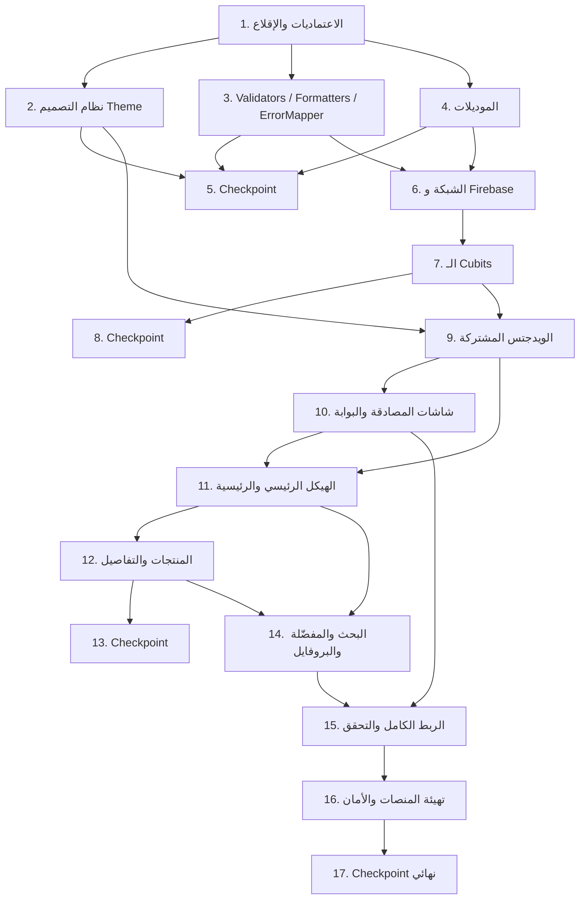

# Implementation Plan: ecommerce-catalog-app

## Overview

خطة تنفيذ تدريجية لتطبيق `shopify` بلغة **Dart / Flutter** (Flutter 3.44.5 / Dart 3.12.2). الترتيب مقصود: نبدأ بالاعتماديات والإقلاع، ثم الطبقات النقية (theme، utils، models) القابلة للاختبار فورًا، ثم طبقة البيانات (services / repositories)، ثم الـ Cubits، ثم الشاشات من الأبسط للأعقد، وننتهي بالربط الكامل وتهيئة المنصات والتحقق الساكن. كل مهمة تبني على اللي قبلها ومفيش كود معلّق بدون ربط.

المهام المعلَّمة بـ `*` اختيارية (اختبارات) ويمكن تخطيها لتسليم أسرع، لكن الخصائص الـ 17 في `design.md` كل واحدة منها اختبار property واحد بـ 100 تكرار كحد أدنى عبر `glados`.

## Task Dependency Graph



المسار الحرج: `1 → 3/4 → 6 → 7 → 9 → 10 → 11 → 12 → 14 → 15 → 16`. المهمة 2 (الثيم) مستقلة عن طبقة البيانات ويمكن تنفيذها بالتوازي مع 3 و 4، لكنها شرط لكل مهام الواجهة من 9 وما بعدها.

```json
{
  "waves": [
    { "wave": 1, "tasks": ["1"] },
    { "wave": 2, "tasks": ["2", "3", "4"] },
    { "wave": 3, "tasks": ["5"] },
    { "wave": 4, "tasks": ["6"] },
    { "wave": 5, "tasks": ["7"] },
    { "wave": 6, "tasks": ["8"] },
    { "wave": 7, "tasks": ["9"] },
    { "wave": 8, "tasks": ["10"] },
    { "wave": 9, "tasks": ["11"] },
    { "wave": 10, "tasks": ["12"] },
    { "wave": 11, "tasks": ["13"] },
    { "wave": 12, "tasks": ["14"] },
    { "wave": 13, "tasks": ["15"] },
    { "wave": 14, "tasks": ["16"] },
    { "wave": 15, "tasks": ["17"] }
  ]
}
```

## Tasks

- [x] 1. تهيئة الاعتماديات وإقلاع التطبيق
  - إضافة الحزم لـ `pubspec.yaml` بإصدارات مثبَّتة: `firebase_core 4.12.1`, `firebase_auth 6.5.6`, `cloud_firestore 6.7.1`, `google_sign_in 7.2.0`, `flutter_bloc 9.1.1`, `equatable 2.1.0`, `dio 5.11.0`, `cached_network_image 3.4.1`, `shimmer 3.0.0`, `google_fonts 8.2.0`, `material_symbols_icons 4.2960.0`
  - إضافة حزم التطوير: `bloc_test 10.0.0`, `mocktail 1.0.5`, `fake_cloud_firestore 4.2.0`, `glados 1.1.7`
  - تشغيل `flutter pub get` والتأكد من زوال أخطاء التحليل في `lib/firebase_options.dart`
  - ضبط `minSdk = 23` صراحةً في `android/app/build.gradle.kts` بدل `flutter.minSdkVersion`
  - استبدال `lib/main.dart` بـ bootstrap: `WidgetsFlutterBinding.ensureInitialized()` ثم `Firebase.initializeApp(options: DefaultFirebaseOptions.currentPlatform)` ثم `GoogleSignIn.instance.initialize(...)` ثم `runApp(ShopifyApp())`
  - إضافة `googleServerClientId` (Web client ID) إلى `lib/core/constants/api_constants.dart`
  - _Requirements: 4.1, 11.1, 11.2_

- [x] 2. نظام التصميم Lux-Commerce كـ Theme
  - [x] 2.1 إنشاء ملفات الـ Design Tokens
    - `core/theme/app_colors.dart`: قيم Light و Dark من جدول الألوان في الديزاين + `productCardSurface`
    - `core/theme/app_dimens.dart`: المسافات 8/16/24/32/48، الحواف 12/16/24، `screenPadding` أفقي 24، و `softShadow` بإزاحة (0,8) وتمويه 24 وأسود 4%
    - `core/theme/app_typography.dart`: تدريج Inter عبر `google_fonts` بتحويل `em` إلى قيم منطقية
    - _Requirements: 10.1, 10.2, 10.3, 10.4, 10.5_

  - [x] 2.2 إنشاء `core/theme/app_theme.dart`
    - `ThemeData` فاتح وداكن ببناء `ColorScheme` صريح (بدون `fromSeed`)
    - تعريفات `FilledButtonTheme`, `OutlinedButtonTheme`, `InputDecorationTheme` (radius 12، حدّ تركيز 1.5)، `CardTheme`, `ChipThemeData`, `NavigationBarThemeData` (بدون نصوص، ارتفاع 80)
    - _Requirements: 10.1, 10.2, 10.3, 10.7_

  - [ ]* 2.3 كتابة widget tests للثيم
    - التأكد من قيم `colorScheme.primary` و `surface` ونمط `labelLarge` وحواف الحقول
    - _Requirements: 10.1, 10.2, 10.3_

- [x] 3. الأدوات النقية: التحقق والتنسيق ومعالجة الأخطاء
  - [x] 3.1 كتابة `core/utils/validators.dart` و `core/utils/formatters.dart` و `core/utils/debouncer.dart`
    - `Validators`: name (غير فارغ بعد trim)، phone (7–15 رقمًا مع `+` اختيارية)، email بالنمط `^[^@\s]+@[^@\s]+\.[^@\s]+$`، password بطول ≥ 6
    - `Formatters`: `price` بمنزلتين عشريتين مع بادئة عملة، `rating` بمنزلة واحدة
    - `Debouncer` بمدة 400 مللي ثانية
    - _Requirements: 1.2, 2.2, 8.4, 8.5, 13.2_

  - [x] 3.2 كتابة `core/errors/failure.dart` و `core/errors/error_mapper.dart`
    - `Failure(message, code)` مع رسائل عربية لكل أكواد `FirebaseAuthException` و `DioException` و `GoogleSignInException` و Firestore حسب جدول Error Handling
    - إرجاع رسالة عامة مع الاحتفاظ بالكود الأصلي لأي كود غير معروف
    - _Requirements: 1.6, 2.6, 3.6, 6.7, 7.10_

  - [ ]* 3.3 كتابة property test لرفض المدخلات غير الصالحة
    - **Property 1: رفض المدخلات غير الصالحة**
    - **Validates: Requirements 1.2, 2.2**

  - [ ]* 3.4 كتابة property test لشمولية تحويل الأخطاء
    - **Property 4: شمولية تحويل الأخطاء إلى رسائل عربية**
    - **Validates: Requirements 1.6, 2.6, 6.7, 7.10**

  - [ ]* 3.5 كتابة property test لثبات شكل التنسيقات
    - **Property 14: ثبات شكل التنسيقات ومؤشر النجوم** (الجزء الخاص بـ `Formatters` فقط؛ جزء النجوم يُكمَّل في المهمة 9.3)
    - **Validates: Requirements 8.4, 8.5**

- [x] 4. موديلات البيانات
  - [x] 4.1 كتابة `data/models/category_model.dart` و `product_model.dart` و `products_response_model.dart` و `app_user_model.dart` و `favorite_item_model.dart`
    - كلها `Equatable` مع `fromJson`/`toJson` يدويًا (بدون codegen)
    - تحليل متسامح: `(json[k] as num?)?.toDouble() ?? 0` للأرقام، نص فارغ للنصوص الناقصة، قائمة فارغة لـ `images`
    - `CategoryModel.listFromJson` يتعامل مع `List` مباشرة لأن `/products/categories` يعيد مصفوفة لا كائنًا ملفوفًا
    - `AppUser.toMap` يستثني `uid` (هو معرّف الوثيقة) ولا يحتوي كلمة المرور أبدًا
    - _Requirements: 1.7, 6.2, 6.3, 7.2, 7.3_

  - [ ]* 4.2 كتابة property test لدورة التحويل الكاملة
    - **Property 9: دورة كاملة لتحويل الأقسام والمنتجات (Round Trip)**
    - **Validates: Requirements 6.2, 6.3, 6.4, 7.2, 7.3, 7.4**

  - [ ]* 4.3 كتابة property test للتحليل المتسامح
    - **Property 10: تحليل متسامح للـ JSON الناقص أو المختلف النوع**
    - **Validates: Requirements 6.2, 7.3**

  - [ ]* 4.4 كتابة مُولّدات `glados` المخصّصة في `test/generators/model_generators.dart`
    - مُولّدات لـ `CategoryModel` و `ProductModel` و `ProductsResponseModel` و `AppUser` تغطي: نصوص فارغة، محارف عربية/يونيكود، أطوال كبيرة، قوائم فارغة وبعنصر واحد، أرقام `int` و `double`
    - _Requirements: 6.2, 7.3_

- [ ] 5. Checkpoint - تأكد أن كل الاختبارات تعمل
  - Ensure all tests pass, ask the user if questions arise.

- [x] 6. طبقة البيانات: الشبكة و Firebase
  - [x] 6.1 كتابة `data/services/api_provider.dart` و `data/repositories/catalog_repository.dart`
    - `Dio` بـ `baseUrl: https://dummyjson.com` و timeouts 20 ثانية و interceptor للـ logging
    - `getCategories()`، `getCategoryThumbnails()` عبر `/products?limit=0&select=id,category,thumbnail`، `getProductsByCategory(slug)` و `searchProducts(q)` مع `select` المحدد في الديزاين
    - تحويل كل `DioException` إلى `Failure` عبر `ErrorMapper`
    - _Requirements: 6.1, 6.10, 7.1, 13.4, 15.5, 15.6_

  - [ ]* 6.2 كتابة property test لبناء مسار الطلب
    - **Property 11: بناء مسار طلب المنتجات**
    - **Validates: Requirements 7.1**

  - [x] 6.3 كتابة `data/services/auth_service.dart`
    - `authStateChanges`، `signUp`، `signIn`، `signOut` (Firebase + Google)
    - `signInWithGoogle()` بواجهة `google_sign_in` 7.x: `GoogleSignIn.instance.authenticate()` ثم `GoogleAuthProvider.credential(idToken:)` ثم `signInWithCredential`
    - التقاط `GoogleSignInException` وإرجاع `null` عند `GoogleSignInExceptionCode.canceled` بدل رمي خطأ
    - _Requirements: 1.3, 2.3, 3.2, 3.3, 3.5, 4.2, 4.7_

  - [x] 6.4 كتابة `data/repositories/user_repository.dart` و `favorites_repository.dart`
    - `saveUser` بـ `set(..., SetOptions(merge: true))` على `users/{uid}` بحقول `name`, `phone`, `email` فقط
    - `getUser(uid)` يعيد `null` عند غياب الوثيقة
    - المفضّلة على `users/{uid}/favorites/{productId}` مع `getFavoriteIds`, `getFavorites` (ترتيب `addedAt` تنازليًا), `add`, `remove`
    - _Requirements: 1.4, 1.7, 3.4, 5.1, 5.4, 14.1, 14.2, 14.4_

  - [ ]* 6.5 كتابة property test لثبات شكل وثيقة المستخدم
    - **Property 3: ثبات شكل وثيقة المستخدم في Firestore** (باستخدام `fake_cloud_firestore`)
    - **Validates: Requirements 1.4, 1.7, 3.4**

  - [ ]* 6.6 كتابة property test لقراءة الوثيقة الصحيحة فقط
    - **Property 6: قراءة وثيقة المستخدم الصحيحة فقط**
    - **Validates: Requirements 5.1, 5.4**

- [x] 7. طبقة الحالة: الـ Cubits
  - [x] 7.1 كتابة `logic/auth/auth_cubit.dart` + `auth_state.dart`
    - حالات: `AuthInitial | AuthLoading(googleFlow) | AuthAuthenticated(uid) | AuthUnauthenticated | AuthError(message)`
    - `signUp` ينشئ الحساب ثم يكتب وثيقة `users/{uid}` قبل إصدار `AuthAuthenticated`
    - `signInWithGoogle` يدمج الوثيقة مع الحفاظ على `phone` المحفوظ سابقًا
    - `signOut` يصدر `AuthUnauthenticated` فورًا ثم ينفّذ الخروج ويسجّل أي خطأ فقط
    - الاستماع لـ `authStateChanges` كمصدر حقيقة واحد
    - _Requirements: 1.3, 1.4, 2.3, 3.3, 3.4, 4.6, 4.7, 4.8, 9.1, 9.4_

  - [ ]* 7.2 كتابة property test لتمرير المدخلات الصالحة
    - **Property 2: تمرير المدخلات الصالحة كما هي**
    - **Validates: Requirements 1.3, 2.3**

  - [x] 7.3 كتابة `logic/profile/profile_cubit.dart` + `profile_state.dart`
    - `ProfileInitial | ProfileLoading | ProfileLoaded(AppUser) | ProfileEmpty | ProfileError`
    - كل استدعاء `load()` يصدر `ProfileLoading` أولًا حتى لو كانت هناك بيانات معروضة
    - _Requirements: 5.1, 5.2, 5.4, 5.5, 5.6, 9.4_

  - [ ]* 7.4 كتابة property test لبداية كل تحميل بحالة Loading
    - **Property 7: كل تحميل يبدأ بحالة Loading**
    - **Validates: Requirements 5.2**

  - [x] 7.5 كتابة `logic/categories/categories_cubit.dart` و `logic/products/products_cubit.dart`
    - `CategoriesCubit`: يصدر `CategoriesLoaded` بالأقسام أولًا ثم يحدّثها بالصور التمثيلية، وتجاهل فشل طلب الصور بدون رسالة خطأ
    - `ProductsCubit`: تحميل منتجات `slug` مع حالتي فراغ وخطأ
    - _Requirements: 6.1, 6.8, 6.10, 6.14, 7.1, 7.11, 9.1, 9.4_

  - [x] 7.6 كتابة `logic/search/search_cubit.dart` و `logic/favorites/favorites_cubit.dart`
    - `SearchCubit`: `Debouncer` 400ms، أقل من محرفين → `SearchIdle`، تصفية الأقسام محليًا (case-insensitive على `name` و `slug`) + طلب `/products/search`
    - `FavoritesCubit`: تحديث متفائل في `toggle` مع تراجع عند الفشل، و `load()`، و `clear()` عند الخروج
    - _Requirements: 13.2, 13.3, 13.4, 13.7, 13.8, 13.9, 14.1, 14.2, 14.3, 14.4, 14.7, 14.9, 9.1, 9.4_

  - [ ]* 7.7 كتابة `bloc_test` لكل Cubit
    - التحقق من تسلسل الحالات المُصدَرة لكل عملية، وإلغاء Google، وفشل `signOut`، وفشل كتابة المفضّلة
    - _Requirements: 3.5, 3.6, 4.8, 9.4, 14.7_

- [ ] 8. Checkpoint - تأكد أن كل الاختبارات تعمل
  - Ensure all tests pass, ask the user if questions arise.

- [x] 9. الويدجتس المشتركة
  - [x] 9.1 كتابة ويدجتس الإدخال والأزرار والشريط العلوي
    - `AppTextField` (عنوان `labelLarge` فوق الحقل + `validator` + إظهار كلمة المرور)، `PrimaryButton` و `SecondaryButton` بحالة `isLoading` تعطّل الضغط، `BrandAppBar` شفاف بـ `BackdropFilter` وعنوان `ESTUDIO`
    - _Requirements: 2.4, 10.7, 10.8_

  - [x] 9.2 كتابة ويدجتس الحالات والصور
    - `AppNetworkImage` غلاف `CachedNetworkImage` مع `placeholder` و `errorWidget`، `ShimmerBox` وشبكات الشيمر، `AppErrorView` و `AppEmptyView` بنص عربي وزر إعادة المحاولة
    - _Requirements: 6.5, 6.7, 6.8, 7.5, 7.10, 7.11, 10.9, 15.1, 15.2, 15.3, 15.4, 15.8_

  - [x] 9.3 كتابة `RatingStars` و `RatingBadge` و `FavoriteButton`
    - `RatingStars` يعرض 5 أيقونات دائمًا مع عدد ممتلئ غير تنازلي في قيمة التقييم + النص الرقمي
    - `FavoriteButton` عبر `BlocSelector<FavoritesCubit, FavoritesState, bool>` يستدعي `toggle`
    - _Requirements: 8.4, 10.6, 14.3_

  - [ ]* 9.4 إكمال property test مؤشر النجوم
    - **Property 14: ثبات شكل التنسيقات ومؤشر النجوم** (جزء عدد النجوم ورتابته)
    - **Validates: Requirements 8.4**

- [x] 10. شاشات المصادقة وبوابة الجلسة
  - [x] 10.1 كتابة `presentation/auth/login_screen.dart` و `register_screen.dart`
    - Login: حقول Email و Password + زر أساسي + زر Google ثانوي + رابط للتسجيل
    - Register: حقول Name و Phone و Email و Password مع `Form` + `Validators` ومنع نداء الخدمة عند وجود خطأ، والحفاظ على القيم المُدخلة عند الخطأ
    - `BlocListener` يعرض رسائل الخطأ ويتنقّل لـ `Main_Shell` مع مسح الـ stack عند النجاح
    - _Requirements: 1.1, 1.2, 1.5, 1.6, 2.1, 2.2, 2.4, 2.5, 2.6, 3.1, 3.6, 9.5_

  - [x] 10.2 كتابة `presentation/auth/auth_gate.dart`
    - Splash قبل أول حدث، `Main_Shell` عند وجود مستخدم، `Login_Screen` عند عدمه
    - _Requirements: 4.2, 4.3, 4.4, 4.5_

  - [ ]* 10.3 كتابة property test لمطابقة البوابة لحالة الجلسة
    - **Property 5: مطابقة شاشة Auth_Gate لحالة الجلسة**
    - **Validates: Requirements 4.3, 4.4, 4.5**

  - [ ]* 10.4 كتابة widget tests لشاشات المصادقة
    - وجود الحقول وزر Google، منع الإرسال المزدوج أثناء التحميل، الانتقال ومسح الـ stack بعد النجاح
    - _Requirements: 1.1, 2.1, 2.4, 2.5, 3.1_

- [x] 11. الهيكل الرئيسي والشاشة الرئيسية
  - [x] 11.1 كتابة `presentation/shell/main_shell.dart`
    - `IndexedStack` لحفظ حالة كل تاب وموضع التمرير + `NavigationBar` بأربع أيقونات بدون نصوص وأيقونة نشطة ممتلئة
    - `MainShellController` لتبديل التاب وطلب التركيز على حقل البحث
    - _Requirements: 12.1, 12.2, 12.3, 12.4, 13.11_

  - [x] 11.2 كتابة `presentation/home/home_screen.dart` وويدجتس البلاطات
    - `CustomScrollView` بهيدر greeting + `HomeSearchField` + `SliverGrid` بعمودين وبلاطة كل ثالث عنصر بارتفاع مضاعف
    - بلاطة بصورة الخلفية + تدرّج أسود + الاسم، أو بلاطة طباعية بالرقم والاسم عند غياب الصورة
    - الانتقال لـ `Products_Screen` مع تمرير الـ `slug`
    - _Requirements: 6.5, 6.6, 6.7, 6.8, 6.9, 6.11, 6.12, 6.13, 6.14, 13.11_

- [x] 12. شاشة المنتجات وشاشة التفاصيل
  - [x] 12.1 كتابة `presentation/products/products_screen.dart` و `product_card.dart`
    - عنوان القسم `headlineLarge`، جريد متجاوب (عمودان تحت 600px وثلاثة من 600px)، كارت بصورة 4:5 على `productCardSurface` بحواف 16 + `FavoriteButton` + العنوان والسعر و `RatingBadge`
    - الانتقال لشاشة التفاصيل مع تمرير `ProductModel` كاملًا
    - _Requirements: 7.5, 7.6, 7.7, 7.8, 7.9, 7.10, 7.11, 7.12_

  - [ ]* 12.2 كتابة property test لعرض القوائم وتمرير العنصر المضغوط
    - **Property 12: عرض كل عناصر القائمة وتمرير العنصر المضغوط**
    - **Validates: Requirements 6.6, 6.8, 6.9, 7.6, 7.12**

  - [x] 12.3 كتابة `presentation/products/product_details_screen.dart` وويدجتسها
    - `ProductGallery` بـ `PageView` 4:5 ونقاط مؤشر عند تعدد الصور، والرجوع إلى `thumbnail` عند فراغ `images`
    - العنوان والسعر المنسّق و `RatingStars`، و `BentoInfoGrid` بخليتي `brand` و `stock` مع استبدال `brand` الفارغ بـ `category`، والوصف الكامل، وزر ثابت أسفل يبدّل المفضّلة، وزر رجوع في الشريط العلوي
    - _Requirements: 8.1, 8.2, 8.3, 8.4, 8.5, 8.6, 8.7, 8.8, 8.9_

  - [ ]* 12.4 كتابة property test لاكتمال شاشة التفاصيل
    - **Property 13: اكتمال شاشة التفاصيل ومعرض الصور**
    - **Validates: Requirements 8.1, 8.2, 8.3**

- [ ] 13. Checkpoint - تأكد أن كل الاختبارات تعمل
  - Ensure all tests pass, ask the user if questions arise.

- [x] 14. شاشات البحث والمفضّلة والملف الشخصي
  - [x] 14.1 كتابة `presentation/search/search_screen.dart`
    - حقل بحث ثابت بأيقونة ونص عربي، قسم الأقسام فوق قسم المنتجات، شيمر أثناء البحث، رسالة «اكتب حرفين على الأقل»، رسالة فراغ تحتوي نص الاستعلام، وخطأ مع إعادة محاولة
    - الانتقال لـ `Products_Screen` لنتيجة قسم و `Product_Details_Screen` لنتيجة منتج
    - _Requirements: 13.1, 13.5, 13.6, 13.7, 13.8, 13.9, 13.10_

  - [x] 14.2 كتابة `presentation/favorites/favorites_screen.dart` و `favorite_tile.dart`
    - قائمة المفضّلة بالصورة والعنوان والسعر والتقييم، وحالة فراغ عربية، ورسالة خطأ عند فشل الكتابة مع تراجع الحالة
    - _Requirements: 14.4, 14.5, 14.6, 14.7, 14.8_

  - [x] 14.3 كتابة `presentation/profile/profile_screen.dart` و `profile_info_tile.dart`
    - أفاتار دائري 128 بأول حرف من الاسم، وعرض `name` و `phone` و `email`، وحالات Loading/Empty/Error مع إعادة محاولة، وزر Logout بعرض كامل بخلفية `primary` وأيقونة
    - _Requirements: 5.2, 5.3, 5.4, 5.5, 5.6, 5.7, 4.6_

  - [ ]* 14.4 كتابة property test لعرض بيانات الملف الشخصي
    - **Property 8: عرض كل بيانات الملف الشخصي**
    - **Validates: Requirements 5.3**

- [x] 15. الربط الكامل والتحقق
  - [x] 15.1 كتابة `lib/app.dart` و `core/routing/app_routes.dart`
    - `MaterialApp` بالثيم الفاتح والداكن، و `MultiBlocProvider` لـ `AuthCubit` و `CategoriesCubit` و `SearchCubit` و `FavoritesCubit`، و `BlocProvider` محلي لـ `ProductsCubit` و `ProfileCubit`
    - `onGenerateRoute` للمسارات `/`, `/login`, `/register`, `/shell`, `/products`, `/product-details`
    - إعادة تحميل المفضّلة عند `AuthAuthenticated` وتفريغها عند `AuthUnauthenticated`
    - _Requirements: 9.1, 12.5, 14.8, 14.9_

  - [ ]* 15.2 كتابة property test لعرض رسالة الخطأ كما هي
    - **Property 15: عرض رسالة الخطأ المُصدَرة كما هي**
    - **Validates: Requirements 9.5**

  - [ ]* 15.3 كتابة property test لصلابة التخطيط
    - **Property 16: صلابة التخطيط عبر العروض واتجاهي النص**
    - **Validates: Requirements 10.10, 10.11**

  - [ ]* 15.4 كتابة اختبار ساكن للمعمارية في `test/static/architecture_test.dart`
    - التأكد من غياب `setState` وغياب استيراد `firebase`/`dio`/`cloud_firestore` داخل `lib/presentation` (باستثناء `main_shell.dart` للتنقّل البصري)، وغياب `Image.asset`
    - _Requirements: 9.2, 9.3, 10.9_

- [x] 16. تهيئة المنصات وقواعد الأمان
  - [x] 16.1 كتابة `firestore.rules` في جذر المشروع
    - قواعد `users/{uid}` و `users/{uid}/favorites/{productId}` بمطابقة صريحة لكل منهما (القواعد لا تتوارث للـ subcollections)
    - _Requirements: 11.6_

  - [x] 16.2 إضافة URL scheme لـ Google Sign-In في `ios/Runner/Info.plist`
    - `CFBundleURLSchemes` بالقيمة المعكوسة لـ `iosClientId`: `com.googleusercontent.apps.802072150133-7aik3se95ed4rfsvlphofksqc1ni9v1l`
    - كتابة `README` قصير بالخطوات اليدوية المتبقّية: تنزيل `ios/Runner/GoogleService-Info.plist`، وتسجيل بصمات SHA-1/SHA-256، وتمكين مزوّدي Email/Password و Google في Firebase Console
    - _Requirements: 11.3, 11.4, 11.5_

  - [ ]* 16.3 كتابة اختبار قواعد Firestore
    - **Property 17: حصر الوصول إلى وثيقة المستخدم على صاحبها**
    - **Validates: Requirements 11.6**

  - [x] 16.4 تشغيل `flutter analyze` وإصلاح كل الأخطاء
    - الوصول إلى صفر أخطاء مُبلَّغة
    - _Requirements: 11.7_

- [ ] 17. Checkpoint نهائي - تأكد أن كل الاختبارات تعمل
  - Ensure all tests pass, ask the user if questions arise.

## Notes

- المهام المعلَّمة بـ `*` اختيارية (اختبارات) ويمكن تخطيها لتسليم أسرع
- كل مهمة تشير إلى معايير قبول محدّدة للتتبّع
- الـ Checkpoints للتحقق التدريجي قبل الانتقال لطبقة جديدة
- كل خاصية من الخصائص الـ 17 تُنفَّذ باختبار property واحد بـ 100 تكرار كحد أدنى عبر `glados`، ويُوسم بتعليق بالصيغة: `// Feature: ecommerce-catalog-app, Property {number}: {property_text}`
- بنود البنية التحتية (بصمات SHA، تنزيل `GoogleService-Info.plist`، إعدادات Firebase Console) خطوات يدوية موثّقة في المهمة 16.2 ولا تصلح للاختبار الآلي

## نقطة التوقف (آخر جلسة)

**تم إنجازه:** المهام 1 → 4 (الاعتماديات والإقلاع، الثيم، الأدوات، الموديلات)، 6 و 7 (طبقة البيانات والـ Cubits الستة)، 9 (الويدجتس المشتركة)، 10.1، 11، 12، 14. الحالة: `flutter analyze` بصفر errors.

**نقطة الاستئناف — نفّذ بهذا الترتيب:**

1. **10.2 + 15.1 معًا** (مترابطتان): `auth_gate.dart` يحتاج `MainShell` الموجود بالفعل، و`app.dart` هو من يوفّر الـ Cubits المشتركة التي تعتمد عليها الشاشات المكتوبة (`AuthCubit`, `CategoriesCubit`, `SearchCubit`, `FavoritesCubit`) — قبل تنفيذهما التطبيق لا يقلع فعليًا لأن `lib/app.dart` ما زال نسخة placeholder من المهمة 1.
2. **16.1** ثم **16.2** ثم **16.4**.
3. الـ Checkpoints 5 و 8 و 13 و 17 والمهام المعلَّمة بـ `*` (اختبارات الخصائص) متروكة، تُنفَّذ عند الحاجة لتقرير الـ PBT.

**نقاط مفتوحة يجب معالجتها في 16.4 أو قبله:**

- `test/core/formatters_test.dart` فيه اختبار فاشل: يتوقّع `Formatters.rating(4.55) == '4.6'` والناتج `'4.5'` (تمثيل `double`). القرار المطلوب: تعديل توقّع الاختبار أو تغيير أسلوب التقريب في `Formatters.rating`.
- 7 تنبيهات `info` من نوع `prefer_initializing_formals` في `lib/logic/*` (نمط حقن موحّد مقصود، أو تُنظّف).
- `SearchScreen` تستخدم كارت نتائج داخليًا (`_SearchProductCard`) بدل `ProductCard`؛ التوحيد اختياري ومحصور في ملف واحد.

**خطوات يدوية على المستخدم (خارج الكود):** تمكين مزوّدي Email/Password و Google في Firebase Console، تسجيل بصمات SHA-1/SHA-256 لأندرويد، وتنزيل `ios/Runner/GoogleService-Info.plist`.
